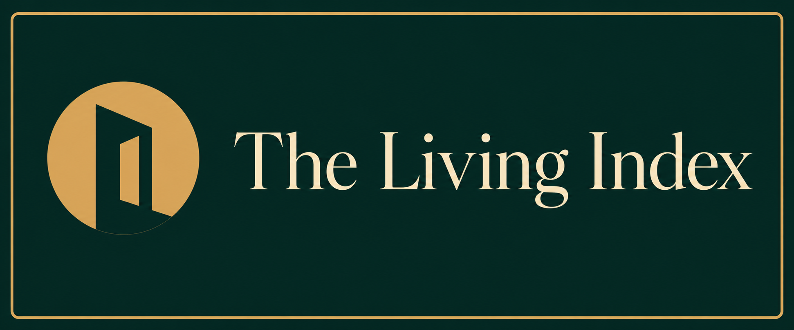
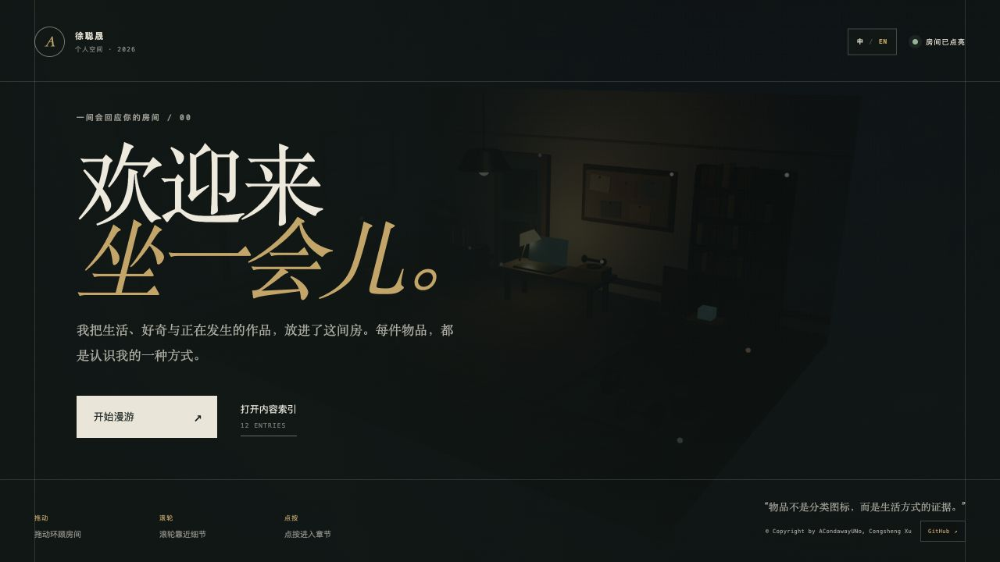
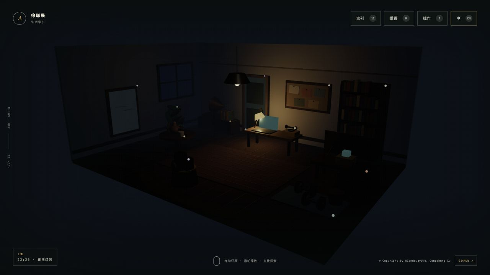
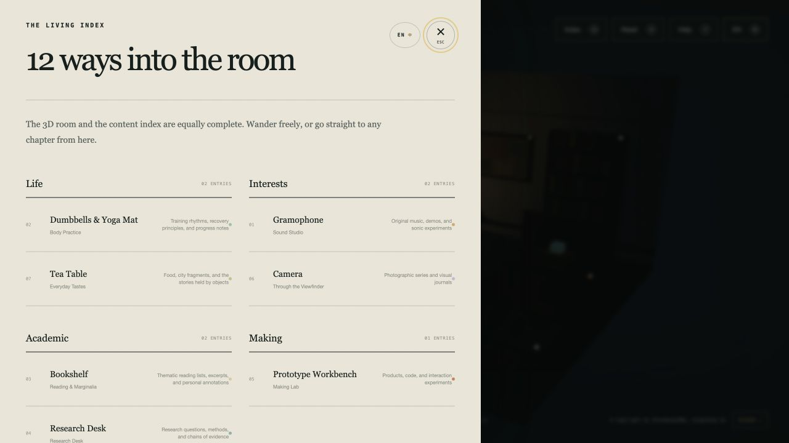
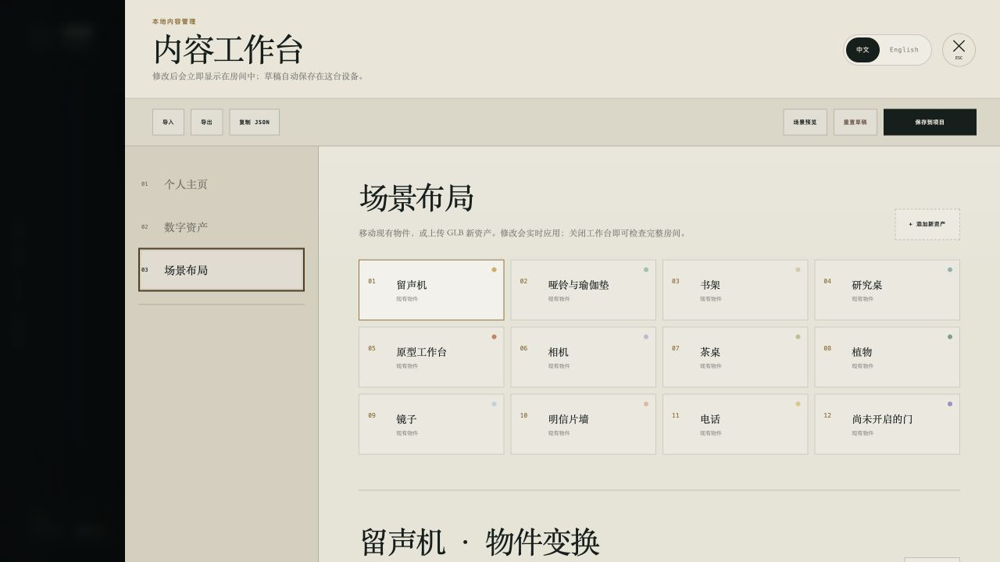

一个 ALL-IN-ONE 的个人主页

<h1></h1>

<h3>把工作、生活、爱好与更多属于你的部分，放在同一个数字空间。</h3>

一个用于呈现完整个体，而不只是简历与作品的中英双语可探索主页。

  <a href="./README.md">English</a>
  &nbsp;·&nbsp;
  <a href="./README_cn.md"><strong>简体中文</strong></a>

  
  
  
  
  
  

  <a href="https://docs.acondawayuno.com"><strong>阅读完整文档 ↗</strong></a>
  &nbsp;&nbsp;·&nbsp;&nbsp;
  <a href="https://github.com/ACondaway/HOME-3D"><strong>查看源代码 ↗</strong></a>

## ✦ 为完整的“你”而设计的一站式个人主页

The Living Index 是一个 **All-in-One 个人主页**，希望呈现一个更完整的人：不只展示做过什么，也展示如何工作、生活、学习、玩耍、关心、记忆，以及如何想象下一步。工作经历、研究、项目、日常生活、兴趣爱好、摄影、音乐、旅行、社交账号、个人笔记和未来计划，都可以被放进同一个连贯的数字空间。

它不再把一个人的身份拆散在作品集、简历、Link-in-bio、相册、博客与社交主页之间，而是通过一间可探索的房间把这些维度重新连接起来。具有个人意义的物件成为不同人生侧面的入口，灵活的内容卡片既可以承载成熟成果，也可以记录那些真正让一个人变得具体的日常细节。

三维房间并不是唯一入口。每一个空间交互都有完整的语义化内容索引与之对应，因此即使没有 WebGL、精确指针操作或动态效果，访客依然可以完整阅读同样的内容。

| 💼 工作与实践 | 🌿 生活与爱好 | ✦ 统一而持续的个人表达 |
|---|---|---|
| 展示项目、研究、职业经历、创作、写作与联系方式。 | 分享音乐、摄影、运动、阅读、旅行、日常仪式、记忆以及任何重要的个人兴趣。 | 在同一个双语、随时间变化且可以持续生长的空间中，连接一个人的所有维度。 |

## 🖼️ 实际体验

<table>
  <tr>
    <td width="50%">
      
       
      🌙 根据作者时区变化的三维房间、物件入口与夜间灯光。
    </td>
    <td width="50%">
      
       
      📖 与三维体验等价的完整内容索引，可在同一界面切换中英文。
    </td>
  </tr>
</table>

## 🛠️ Content Studio

Content Studio 让这个 All-in-One 个人主页保持可编辑，同时避免退化成一个通用 CMS。它支持中英文个人资料、纯文字/图文/链接卡片、个人摄影、社交账号、自定义 GLB 资产与实时场景排布。

物件既可以通过数值精确设置，也可以进入可确认的拖动会话，分别调整平面位置、高度和方向旋转。导入的资产可以只作为装饰，也可以成为拥有独立内容页面的交互入口。

GLB 会先从可清理的缓存中预览；点击 **保存到项目** 后，仅最终引用的模型会进入项目，同时生成一份可供开发者与 Coding Agent 审查的场景配置源码。

## 🤖 为 Coding Agent 原生设计

Fork 这个项目后，只需描述你想改变的内容、物件或交互，Coding Agent 就可以依据仓库内置的 Agent Skills 工作。技能包沉淀了内容 schema、中英双语编辑模型、Three.js 场景约定、资产安全规则、验证门禁与 push-to-deploy 流程，让 DIY 从表达意图开始，而不是重新摸索代码结构。

| [`$living-index-content`](./skills/living-index-content/SKILL.md) | [`$living-index-scene`](./skills/living-index-scene/SKILL.md) | [`$living-index-native-assets`](./skills/living-index-native-assets/SKILL.md) | [`$living-index-developer`](./skills/living-index-developer/SKILL.md) |
|---|---|---|---|
| 个人资料、媒体、摄影、Spotlight、社交链接与组合式卡片。 | 时区光照、摆放、GLB 资产与场景行为。 | 用 Three.js 原生生成轻量家具、道具、灯光与装饰。 | 新框架能力、无障碍交互、测试与安全交付。 |

从仓库内的 [Coding Agent 指南](./AGENTS.md) 开始。所有 skills 都是可检查、可修改、可复用并采用 MIT 许可的纯 Markdown。

## 🌱 未来可以生长成什么

The Living Index 从一个人的数字主页开始，但更长远的愿景，是帮助更多人搭建属于自己的空间，并让这些各不相同的空间在保留个性的前提下，逐渐连接成一个社区。

| 🏡 让更多人拥有自己的空间 | 🫂 搭建共享空间社区 | 🌐 形成开放的创作生态 |
|---|---|---|
| 通过引导式编辑、可复用房间模板、主题起步包与 Agent 辅助定制降低门槛，让不会写代码的人也能表达和搭建。 | 让人们可以访问、连接并共同创造彼此的空间，逐步探索共享展览、协作房间、社区街区、留言簿，以及围绕共同兴趣形成的小型聚会。 | 建立由社区共同丰富的主题、原生道具、GLB 资产、内容模块与 Agent Skills 资源库，在支持自由组合的同时保留署名、可迁移性、隐私和个人所有权。 |

目标并不是让所有空间变得相同，而是提供一套可以共享的基础，让更多人表达自己、决定哪些内容保持私密，并在愿意的时候，把自己的房间连接到一个更大的空间星群中。

## 🧩 功能亮点

- 🏠 **All-in-One 个人主页** — 在同一个数字空间中组织工作、生活、爱好、项目、记忆、社交账号与未来计划。
- 🤖 **Agent-native 定制** — 仓库内置 skills 将自然语言意图转化为遵循真实架构与验证规则的代码改动。
- 🌐 **原生双语结构** — 中英文共享同一套空间与交互系统，同时保持独立的编辑内容。
- ☀️ **作者时区光照** — GMT 固定偏移或 IANA 时区共同驱动时钟、太阳弧、晨昏与室内灯。
- 🪞 **以物件组织叙事** — 十二件内置房间物件打开不同的内容章节与视觉模块。
- 📷 **完整摄影展示** — 所有照片都会展示，Spotlight 图片拥有单独的文字介绍区域。
- 🧱 **组合式内容卡片** — 纯文字、图文和链接按钮可以使用标准、宽版或整行布局。
- 🧭 **直接编辑场景** — 移动、升降、旋转、缩放并确认物体摆放，不需要离开可视化编辑器。
- 📦 **导入自有资产** — 经过校验的自包含 GLB 可以作为新物件，也可以可逆地替换内置物件外观。
- 🧰 **直接生成轻量道具** — Coding Agent 可以复用房间的 Three.js 原生几何生成响应光照的简单资产，无需先制作 GLB。
- ♿ **与 3D 等价的阅读路径** — 语义化导航、键盘、减少动态效果和 WebGL 降级属于核心体验。

## ⚙️ 技术栈

`Three.js` · `React 19` · `TypeScript` · `vinext` · `Vite` · `Cloudflare Workers`

项目直接使用 Three.js 管理场景生命周期、Raycaster、相机运动、光照、物体操作与 GPU 资源清理；React 负责编辑界面、状态与可访问内容层。

## 📚 完整文档

README 只负责项目介绍与视觉预览。本地开发、Content Studio 工作流、内容模型、自定义资产、场景摆放、校验、部署和问题排查统一维护在 Mintlify：

### **[docs.acondawayuno.com →](https://docs.acondawayuno.com)**

## 📄 开源许可

本项目源代码与 Agent Skills 均依据 [MIT License](./LICENSE) 开源。后续加入的第三方资产仍遵循各自许可证，并记录于 [ASSET_CREDITS.md](./ASSET_CREDITS.md)。

© ACondawayUNo · Congsheng Xu

